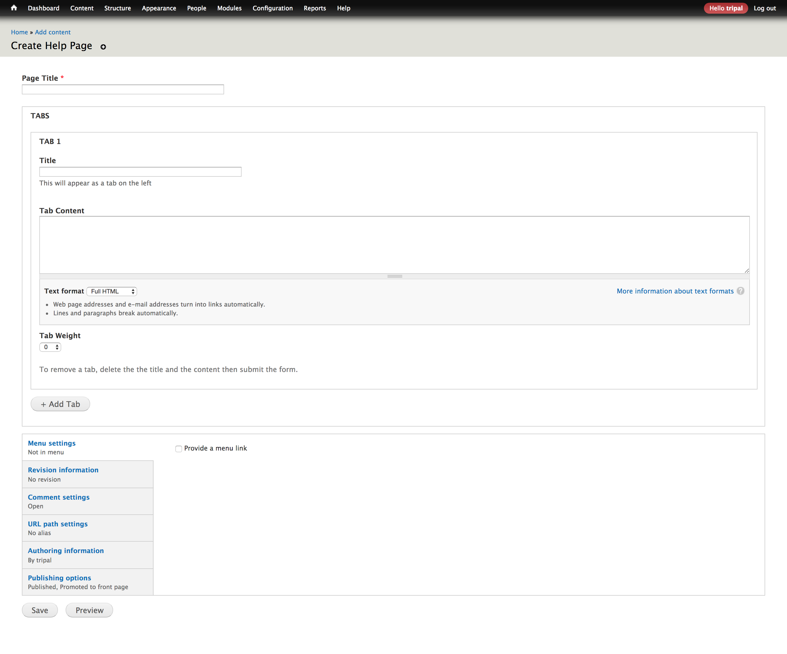

## Intorduction
This module creates a new content type for help pages.

## Installation
Clone to `sites/all/modules/` then enable just like any Drupal module.

## Usage
Once enabled, this module creates a new content type called `Help Page`.
Visit `/node/add/help` to create a new help page. Each help page can contain
as many tabs as you see fit.

A help page is simply a node, therefore can become a menu item or be given a permanent URL address.
